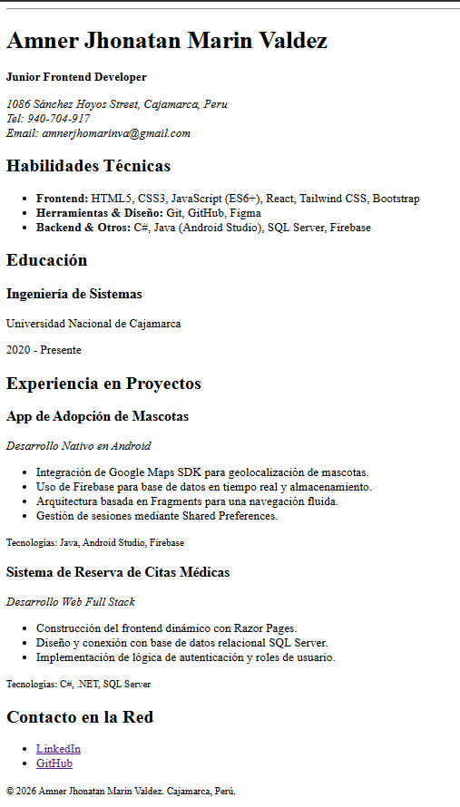
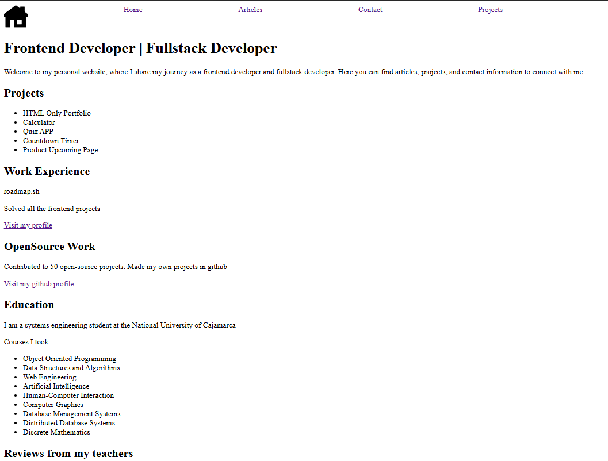
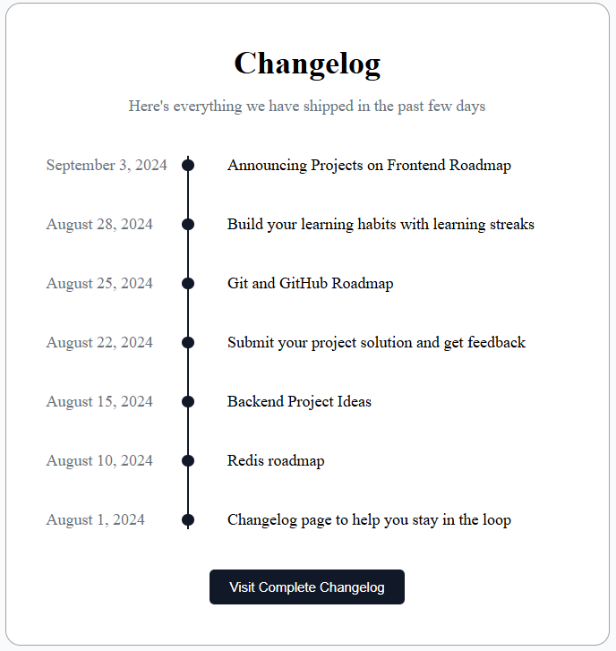
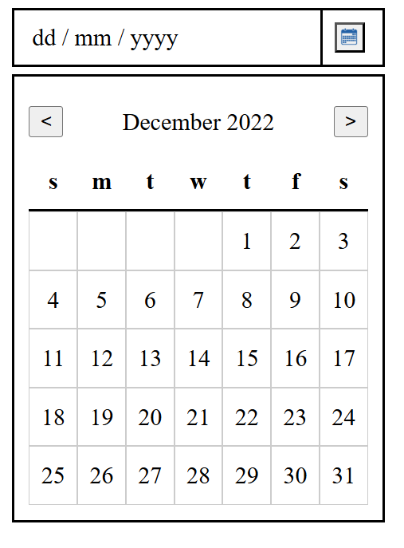
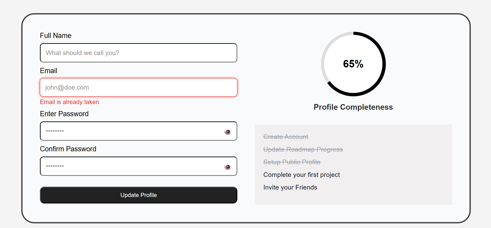

# roadmap-fullstack-proyects
---
### This repository contains exercises from the roadmap.sh front-end developer track.
---

## Projects List

|**[1. Single Page CV](https://roadmap.sh/projects/single-page-cv)**       |**[2. Basic HTML Website](https://roadmap.sh/projects/basic-html-website)**                            |
|---------------------------------------------------------------------     | ------------------------------------------------------------------------------------------            |
| |    |

|**[3. Changelog Component](https://roadmap.sh/projects/changelog-component)**      |**[4. Datepicker UI](https://roadmap.sh/projects/datepicker-ui)**                          |
|---------------------------------------------------------------------              | ------------------------------------------------------------------------------------------            |
| |  |

|**[5. Accessible Form UI](https://roadmap.sh/projects/accessible-form-ui)**      |   **[6. Testimonial Cards](https://roadmap.sh/projects/testimonial-cards)**    |
|---------------------------------------------------------------------              | -----------------     |
| | |

